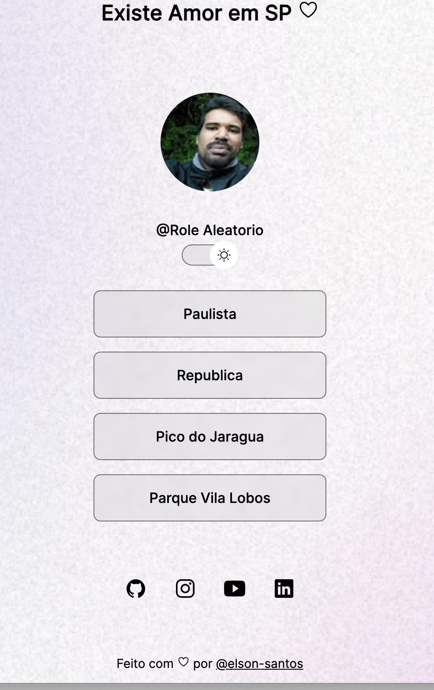
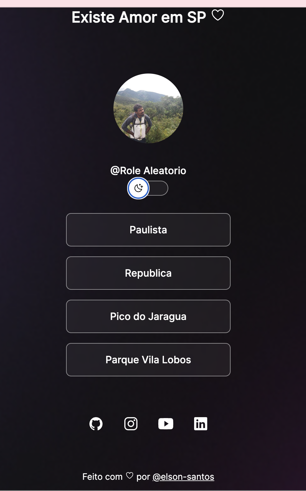

<h1 align="center">Role Aleatorio</h1>

 Role e caminhadas pela a cidade com um incrivel contraste e rica de oportunidades de passeios, sejam bem vindo ao projeto role aleatorio 

    <a href="#tech-Tecnologias">
    Tecnologias
    </a>
    &nbsp;&nbsp;&nbsp;| &nbsp;&nbsp;&nbsp;
    <a href="#-Projeto">
    Projeto
    </a>
    &nbsp;&nbsp;&nbsp;| &nbsp;&nbsp;&nbsp;
    <a href="#-Layout">
    Layout
    </a>
    &nbsp;&nbsp;&nbsp;| &nbsp;&nbsp;&nbsp;
    <a href="#memo-Licença">Licença</a>
     &nbsp;&nbsp;&nbsp;| &nbsp;&nbsp;&nbsp;

    

 

    
     &nbsp;&nbsp;&nbsp;&nbsp;&nbsp;&nbsp;
    

 

## : Tecnologias

- HTML e CSS
- JavaScript
- Git e GitHuhub

## : Projeto

Projeto com algumas sugetoes de Roteiro pela a cidade de Sao Paulo

## : Layout

## :memo: Licença

Esse projeto esta sob a licença MIT.
